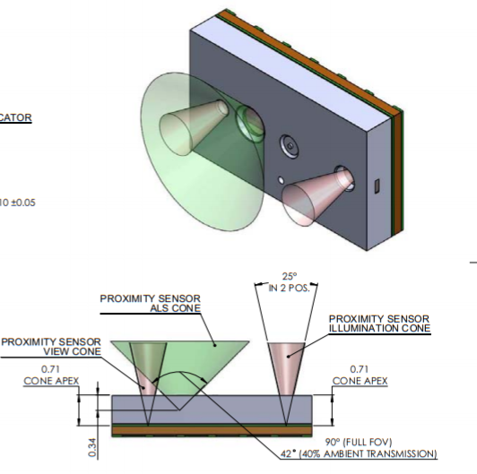
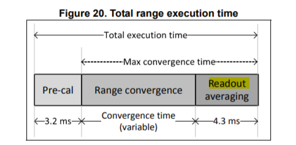

Proximity Sensors Note:
======

Sensor of Choise
------
We tested with different sensors:

|         |            |   |   | |
| ------------- |:--------:| ---------|--------|--------|
| vcnl4040      | APDS9600 | VCNL4010 | POLOLU | VL6180X 

and we chose the VL6180X because it is the only one with changable address and high precision in close range (10cm)

We acquired 4 of them and set them as an array with one Arduino

The Libraray used can be found [Here](https://github.com/pololu/vl6180x-arduino). 
>Going through the library's documentation should be helpful of understanding the codebase, though we have made some modifications to the original library file, and that will be specified in Optimization part.


Basic Funtionality of VL6180X
------

The datasheet can be found [Here](https://www.st.com/resource/en/datasheet/vl6180x.pdf). 
>Though you don't have to read all of it, cpt. **2.5** and **2.7** is very helpful for understanding the software and cpt. **7** has a great schematic for it's range and functionality. 


>Also, it listed thoroughly about its registers and their bits' functionality in cpt.6. If you want to know about a particular register, you can search the name in the datasheet to find out the usage.

Teh VL6180X sensor has two basic functionalities-- Range, which is what we need, and ALS( ambient light sensing), which is useless in this project and should be ignored and disabled for performance. 


The sensor operates in a cone-shaped (as shown below in purple) way:

multiple tests suggests that when different objects are in range, it will read the one with most reflective area, or averge the distance if area are alike.

The range is typically 10mm - 150mm, and it depends on the material, reflectiveness, and area. In our case, the range is shortened to about 80 mm for better performance and less noise. 

Latency Measurement and optimization
-----

### Latency Measurment

The latency is measured by using the slo-mo(240hz) of iphone and count the frame difference of when object distance less than 50 mm and when the LED is on

### Bandwidth Measurment

The bandwidth is measured by outputing the time since program executed and thus the time difference can be measured

```Arduino
    Serial.println(millis() % 1000);
```

#### The default settings are in 10 hz for bandwidth and about 100ms for latency, but by tuning up the parameters, we can get a better performance of 30ms

#### In addition, they actually run in a pipeline and I have no idea why, but because of that, the overhead of adding extra sensors is almost negligible

### Optimization

Read the cpt.2.5 and 2.7 of datasheet for basic functioning principles. We are using the interleaved mode in our case.

More detailed parameter tuning are defined and annotated in the VL6180X.cpp:

```C++
    void VL6180X::configureDefault(void)
```

Some key parameters to notice:


1. Max_Convergence_Time:
    - Directly related to latency, the shorter this time the shorter the latency, however more prone to noise.
    - I used 5 to achieve a latency of about 30-40ms, less than 5 would lead to untoleratable noise
2. Readout_Time:
    - The readout time is the time of averaging samples and is directly related to noise. in a fixed max_convergence_time, the more readout_time means less for range and thus shorter range. 
    - I used the default of 4.3ms (by storing 48 into READOUT__AVERAGING_SAMPLE_PERIOD) and the range is shortened from 150mm to about 80mm.
3. Range_Period:
    - It's simply the bandwidth of the sensors. Lower the period may result in the crash of the sensor (it gives no response always time out).  
    - As provided in the datasheet:

    > VL6180x_RangeSetMaxConvergenceTime() + 5 ≤
VL6180x_RangeSetInterMeasPeriod() * 0.9

    - I used 30 for 30ms of bandwidth, 20ms would work for the formula but in rare cases it may crash. I used a higher number for safety.

Set-Up guide
---
### Setting up series of sensors:

Pins on Sensor | Pin on Arduino (nano33) | 
---|---|----
VIn| 3.3V
GND| GND
SDA| A4
SCL| A5
SHDN| Different enable pins 

### Sensor Limits:

The current code can hold about 12 sensors for different enable pins. However, the enable pins are only used for setting addresses and, in theory, if preset all the addresses, it can hold as many as 127 sensors. But I have not figured this part yet